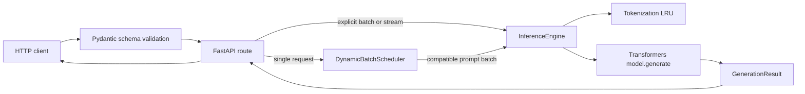

# Architecture Walkthrough

This document explains how a request moves through InfEng and why the main pieces
are separated. Read it alongside the explanatory comments in `src/infeng/`.

## Component map

| Module | Responsibility |
| --- | --- |
| `config.py` | Process-wide model, safety, scheduler, timeout, and cache settings |
| `sampler.py` | Immutable per-request decoding options |
| `schemas.py` | Pydantic validation and HTTP wire models |
| `api.py` | FastAPI lifecycle, routes, errors, request IDs, and SSE protocols |
| `scheduler.py` | Bounded queue and admission-window dynamic batching |
| `engine.py` | Tokenization, model execution, decoding, streaming, and accounting |
| `cache.py` | Bounded exact-prompt tokenization LRU |
| `metrics.py` | Thread-safe in-process counters |
| `results.py` | Typed transport-neutral generation results and stream events |

## Request flow



The engine has no HTTP dependency. That boundary is important: the same core code
is exercised directly by tests and benchmarks, while `api.py` owns status codes and
JSON/SSE formatting.

## Startup and shutdown

FastAPI's lifespan handler loads the engine and starts the scheduler. Model loading
does not happen merely by importing `infeng.api`. If loading fails, the process stays
alive: `/live` returns success while `/ready` returns a controlled 503. On shutdown,
the scheduler stops accepting work before the model reference is released.

## Dynamic admission batching

Ordinary `/generate` calls enter a bounded FIFO queue. The scheduler takes the oldest
request and waits for a short configurable window (20 ms by default). During that
window it gathers requests with exactly equal `SamplingParams`, up to the engine's
maximum batch size. Incompatible work remains queued and the oldest incompatible
request leads the next batch, bounding unfairness to one model call.

This is dynamic **admission** batching, not full continuous decoding. Once
`model.generate` begins, new requests cannot join that running batch. True
mid-decode insertion requires a custom token-step scheduler and paged KV-cache
management.

Seeded sampling calls deliberately run alone. Batched multinomial sampling consumes
random numbers across rows, so changing neighboring requests could otherwise change
the output produced for the same seed.

## Padding and logical token accounting

Decoder-only models are left padded. For prompts of lengths one and two, the physical
input tensor has width two for both rows, but the first row's leftmost token is only
padding. The attention mask records the real prompt lengths.

Generated IDs begin after the physical padded width. Billing metadata uses the
logical attention-mask count:

```text
physical output slice = output_ids[padded_input_width:]
logical total tokens  = real_prompt_tokens + generated_tokens
```

Keeping those values separate prevents shorter batch rows from being charged for
padding.

## Streaming

`model.generate` is a blocking producer and `TextIteratorStreamer` is a blocking
consumer, so streaming generation runs on a background thread. The caller iterates
decoded text fragments immediately. A final `done` event carries the same typed
result used by non-streaming endpoints. If the client closes the generator, a
cancellation event is checked between decoding steps.

The native endpoint emits named SSE events (`chunk`, `done`, `error`). The
OpenAI-compatible endpoint emits `data:` frames and terminates with `data: [DONE]`.

## RNG and concurrency

Greedy decoding does not acquire the sampling lock. Sampling calls are serialized
because PyTorch's default RNG is process-wide. For an explicit seed,
`torch.random.fork_rng` restores the previous CPU/CUDA RNG state after generation,
so the request is deterministic without perturbing unrelated future calls.

A bounded semaphore separately limits physical model calls. The scheduler queue
provides backpressure before work reaches that scarce capacity.

## Caches

Transformers' attention KV cache is explicitly controlled by `use_kv_cache` and can
be disabled for benchmark comparisons. The project also has an exact-prompt
tokenization LRU. Token tensors stay on CPU and are cloned at cache boundaries.

The tokenization LRU is **not** a prefix-KV cache. Reusing model KV tensors safely
requires ownership-aware cache cloning or a custom paged decode layer; that remains
a later milestone.

## Test strategy

- `test_engine.py` loads TinyGPT2 once and verifies real generation behavior.
- `test_api.py` uses a fake engine so lifecycle and wire-contract tests are fast.
- `test_scheduler.py` records physical calls to make grouping/fairness deterministic.
- `test_cache.py` and `test_config.py` are small unit tests without model loading.

This split gives broad coverage without downloading and constructing a model for
every test case.
